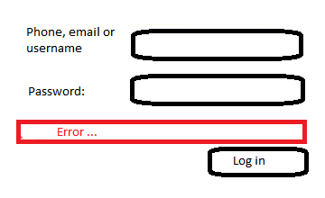
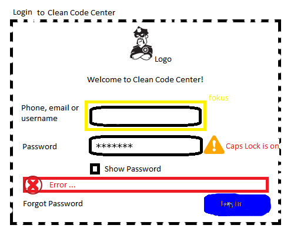

# Login Form Requirements

## Requirements for Bare Functionality

### Existing Code "Backend"

Depending on the used technology, assume an Authentication service, facade or end point. It has a method to `authenticate` a user based on the user's phone, email or user name and her password. The call returns an `AuthenticationResult` which indicates success and an optional message. From now on the combination of a user's phone, email or user name is called the user's lookup.

### Login

UI

* There is a user name field, which is limited to 20 characters.
* The label "Phone, email or username" is next to the input field.
* There is a password field, which is limited to 20 characters.
* The password is either visible as asterisk or bullet signs.
* The label "Password" is next to the input field.
* There is a label in a red box above the button(s). It is only visible if there is an error.
* There is a "Log in" button in right corner of the dialog.

Logic

* User name and password given, button "Log in" clicked, backend reports success, dialog is closed.
* User name and password given, button "Log in" clicked, backend reports no success, show message in error line.

## Requirements for More/Optional Functionality

### More Logic in View

* Username is blank, "Log in" button is inactive.
* Password is blank, "Log in" button is inactive.

### More UI Elements

* Dialog title or page title or border title is "Login to Clean Code Center"
* The Code Cop logo is displayed on top of the window, centred. See [ApplicationLogo](./ApplicationLogo.gif).
* The message "Welcome to Clean Code Center!" is displayed, centred below the logo.

### Styling

* Background color is white.
* Border around everything is 1px dashed, with colour #cccccc.
* Welcome text is 'Trebuchet MS', Trebuchet, Arial, Verdana, Sans-serif, with colour #cc6600 (orange), size 15 pt.
* All other text is Georgia, Serif, with colour #333333, size 12 pt.
* Error messages are prefixed with little red error icon, form of an (X).
  An icon `icon-library.net_error-image-icon-21` is provided.
  Taken from [Error Image Icon #95181](https://icon-library.net/icon/error-image-icon-21.html).
* The "Log in" button is dark blue.

### UI Setup

Focus and tab order

* When it opens, user name field is focused. The focus is shown by a yellow rectangle around the field.
* Tab moves focus through fields: user name, password, ..., Log in button.

### Even More UI Elements

* There is a link or button "Forgot Password" in bottom, left corner.
* There is a check box "Remember Me". If it is enabled, the backend is notified after a successful login.

### More Interactions between UI and Presenter

* Enter on user name field triggers log in.
* Enter on password field triggers log in.

Show Password

* There is a check box "Show Password" below the password input field, initially off.
* If Show Password is enabled, the password is visible. If it is disabled, the password is invisible again. This happens during typing.

Caps Lock Warning

* While typing in user name field, if Caps Lock is on, display a warning next to field "Caps Lock is on".
* While typing in password field, if Caps Lock is on, display a warning next to field "Caps Lock is on".
* Warning texts are prefixed with little orange warning icon (!)
  An icon `icon-library.net_error-image-icon-11` is provided.
  Taken from [Error Image Icon #95188](https://icon-library.net/icon/error-image-icon-11.html).

Captcha

* A Captcha is displayed on 10+ try to login unsuccessfully. Refresh Captcha on each try.

## Resources

* [Designing UX Login Form and Process](https://uxplanet.org/designing-ux-login-form-and-process-8b17167ed5b9)
* [How to Write Test Cases For a Login Page](https://www.softwaretestinghelp.com/login-page-test-cases/)
* [How to Test a Login Form](https://www.automatetheplanet.com/interview-questions-how-test-login/)
